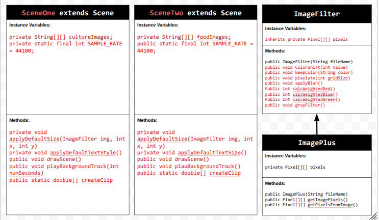
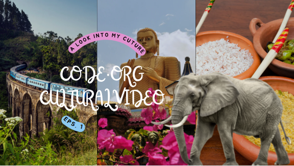

# Personal-Narrative-Interest-Animation-Project
# Unit 5 - Personal Narrative / Interest Animation

## Introduction

Images are often used to portray our personal experiences and interests. We also use image filters and effects to change or enhance the mood of an image. When combined into collages and presentations, these images tell a story about who we are and what is important to us. Your goal is to create an animation using The Theater and Scene API that consists of images of your personal experiences and/or interests. In this animation, you will incorporate data related to these experiences and/or interests that can be organized in a 2D array, and use image filters and effects to change or enhance the mood of your images.
## Requirements

Use your knowledge of object-oriented programming, two-dimensional (2D) arrays, and algorithms to create your personal narrative collage or animation:
- **Write Scene subclasses** – Create two Scene subclasses: either two core parts of your personal life, or two components of a personal interest. Each class must contain a constructor and private instance variable with data related to the scene
- **Create at least two 2D arrays** – Create at least two 2D arrays to store the data that will make up your visualization.
Implement algorithms – Implement one or more algorithms that use loops and logic that operate on the data in your 2D arrays.
- **Create a visualization** – Create an animation that conveys the story of the data by illustrating the patterns or relationships in the data.
- **Image Filters** – Utilize the image filters created in this unit (and possible new filters) that show a personal flare to the images used in your animation.
- **Document your code** – Use comments to explain the purpose of the methods and code segments and note any preconditions and postconditions.

## UML Diagram

## Video

[] (https://youtu.be/feGsVoEA8OA)

## Story Description

This animation is a story of my culture and my favorite foods/drinks. In the class, sceneOne, images like my country flag, main religion (buddhism), popular festivals where people dress up in cultural attire, and the Kandy parade or perahara which is a 10-day festival in Kandy to honor Buddha is shown. Elephants are shown because it features costumed elephants, dancers, drummers, etc. In the SceneTwo class, there are images of Kothu which is a dish made of roti, vegetables, and sauces. Following that, are images of Honey Rings, a deep fried sweet with sugar syrup and egg hoppers which are round-shaped frice dough with an egg in the center, typically eaten for breakfast. The drink images that I put were some of my favorites including King Coconut,diwul which is a drink made of woodapple, necto, a popular drink from the brand Elephant House, and falooda which consists of chia seeds, sweetened milk, and topped with ice cream. The data that is represented in my 2D array for SceneOne is the image file name and then the title. The data that is represented in my 2D array for SceneTwo is the image file name for either the food or drink, followed by the title. This data is useful because in order for the recap to happen, the 2D array is needed.

## Image Filter Analysis

The image filter I created was the grayFilter. First, this filter gets the 2D array of all the pixels in an image, specifically necto and falooda because it was called in SceneTwo. Then, using a for loop, it loops through the rows and the columns. Using Pixel p = pixels[row][col], it gets the current pixel. Then through, int gray = (p.getRed() + p.getGreen() + p.getBlue()) / 3, it calculates the average of red, green, and blue, dividing by three since there are only three color values. Then, it sets all RGB values to gray.
